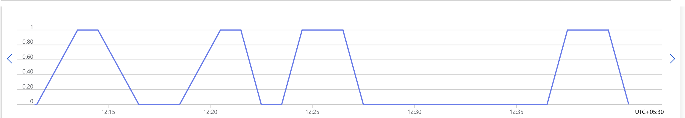
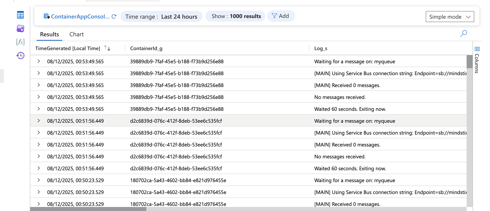
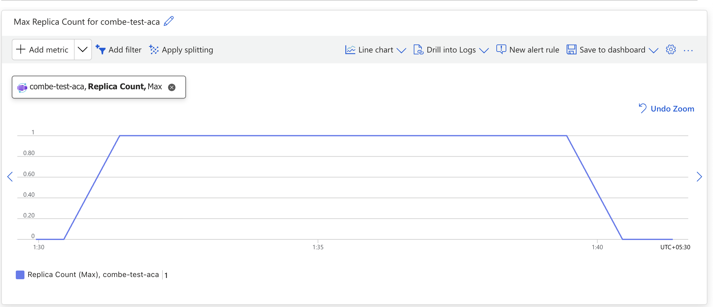
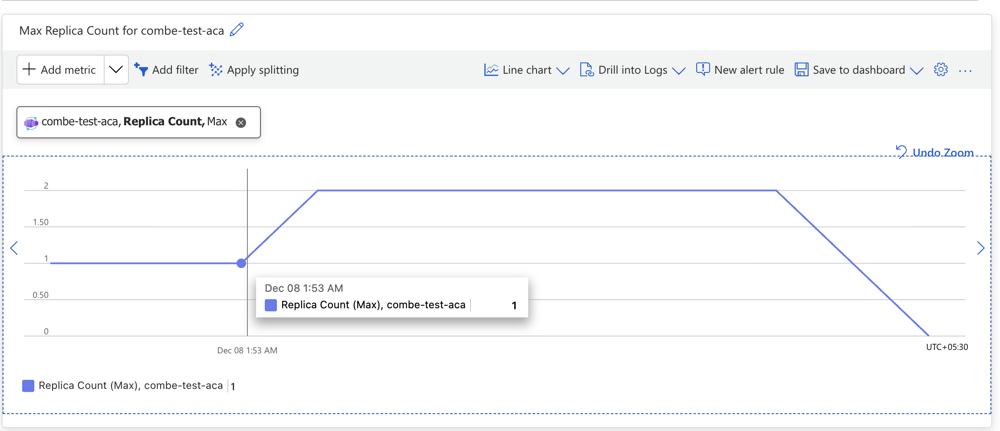

# ACA KEDA Scaling Test

This repository demonstrates Azure Container Apps (ACA) scaling behavior using KEDA, focusing on how containers handle message processing and scale-down events.

## Purpose
The goal is to observe whether ACA waits for a message to finish processing before scaling down, or if it terminates the container after the cooldown period, even if processing is still ongoing.

## Files
- `app.py`: Main application logic for receiving and processing Service Bus messages.
- `Dockerfile`: Container image definition for deployment.
- `requirements.txt`: Python dependencies.

## Scenario 1: Main Thread Processing (No Background Worker, 3 min Cooldown)
- **Setup:**
  - A single message is sent to an Azure Service Bus queue.
  - The container app receives and processes the message on the main thread (no background worker).
  - Processing simulates a long-running task (6 minutes).
  - KEDA is configured with a cooldown period of 3 minutes.

- **Test:**
  - Observe if the container app scales down after 3 minutes (cooldown) or waits for the 6-minute processing to complete.

- **Observations:**
  - 

  - Container scales down after 3 minutes and doesn't wait for the processing to finish. KEDA scales down the container after the cooldown period.
  - Whenever container app was scaled using KEDA, no console logs were visible in log analytics. If manually scaled (hence 0 message workflow), logs were visible. It is possible that if container doesn't complete successfully (because KEDA scales it down after 3 minutes), no console logs are stored.

## Scenario 2: Long Processing (6 min) with Extended Cooldown (8 min)
- **Setup:**
  - A single message is sent to the queue.
  - The container app processes the message for 6 minutes on the main thread.
  - KEDA is configured with a cooldown period of 8 minutes (longer than the processing time).

- **Test:**
  - Observe if the container app remains active for the full 6 minutes, allowing processing and log output to complete before scale-down.
  - This scenario helps determine if missing console logs in log analytics are due to premature scale-down (before processing/logging finishes) or another issue.

- **Observations:**
  - 
  - If replica is running and the container has completed its processing. Container will keep restarting and again execute till the replica stops (cooldown period). This is why we see multiple container start system messages while a replica is running.
  - If the cooldown period is longer than the processing time (8 min cooldown, 6 min processing), the container finishes processing and logs console output before scale-down. This helps confirm log loss is due to premature termination.

## Scenario 3: Multiple Replicas, Sequential Messages (3 min Processing, 5 min Cooldown)
- **Setup:**
  - Send a message and scale a replica.
  - Before the cooldown period ends, send another message to scale a second replica.
  - Each message is processed for 3 minutes.
  - KEDA is configured with a cooldown period of 5 minutes.

- **Test:**
  - Observe when the first and second replica scale down: after their individual cooldown periods or after the latest cooldown period.

- **Observations:**
  - 
  - If a message is completed instantly but the container is still processing, and a new message arrives during this time, KEDA still sees only one message in the queue and one replica running. It does not trigger a scale-up.
    - The new message will either:
      - Be processed by the same replica after the current container finishes (if there is still time left before the replica scales down and a new container can start), or
      - Remain in the queue until the replica is scaled down, after which KEDA will scale up a new replica to process the message.
    - Note: If the replica stops before the new container finishes processing the new message, that message can be lost. This behavior means messages may not be processed immediately if a replica is already busy, and scale-up only happens after the cooldown period ends and the queue is still not empty.
    - In this case, the replica will be scaled down after the cooldown period of the second message's processing time (i.e., the cooldown is reset with the latest message and the replica stays up until that period ends).
  - 
  - If you do not complete the first message instantly and, for example, wait for 3 minutes before completing it, and in the meantime send a second message (so there are 2 messages in the queue, one sent at 1:51 AM and another at 1:53 AM), KEDA will scale up to 2 replicas. Both replicas will scale down together after the end of the latest cooldown period, which is at 1:58 AM (5 minutes after the second message).

